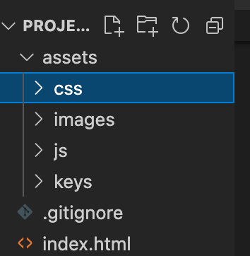

# Project-1-Group-7 - Pawsome Pet Finder

 **What does this application do and why?**

* Searches for pet adoption organizations based on a user's input of a city
* Autocompletes city searches for the user 
* Displays a list of organizations in or near the city entered by the user
* Sorts said organizations by distance, closest to farthest away
* Displays a map of the city the user inputs. 
* Gives the user a list of nearby organizations where they can adopt their next furry friend!

**How the application is organized**
The Day Scheduler is organized in the following files:

**Step-by-Step on how to run the application**
* Begin typing city into Search Bar
* Choose from autocomplete dropdown list which city 
* When the Search Button is clicked, a list of organizations sorted by nearest to farthest is shown
* Click on an organization to find out more info on the shelter and its available pets
* If you wish to search another city, click the Clear History button and start again!

**What the application looks like**

**Link to deployed version of Pawsome Petfinder**

Website: https://echandlerdavis.github.io/Project-1-Group-7/
GitHub Repository: https://github.com/echandlerdavis/Project-1-Group-7

**Technologies Used** 

* html
* css
* javascript
* Server-side APIS
* Third party APIs
* Bootstrap
* Google fonts
* Google Maps API
* Petfinder API

**Contributor Roles**

* html & css - Nathan
* Google Maps API - Ivy
* Petfinder API - Nathan, Ivy and Chandler
* Overall Javascript - Whole Group
* README - Chandler
* Repository managment - Chandler
* Presentation - Jacob 
